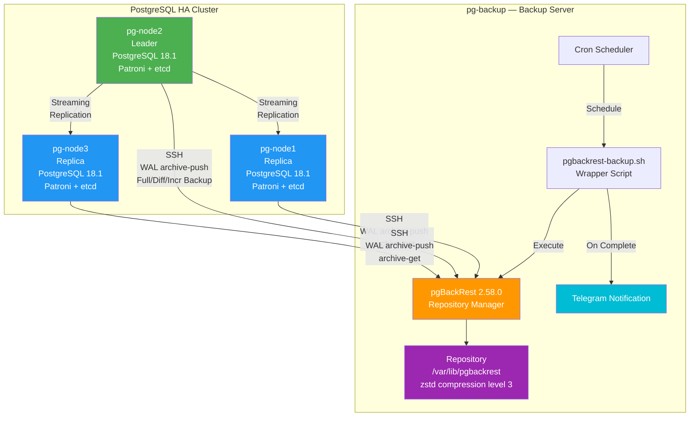
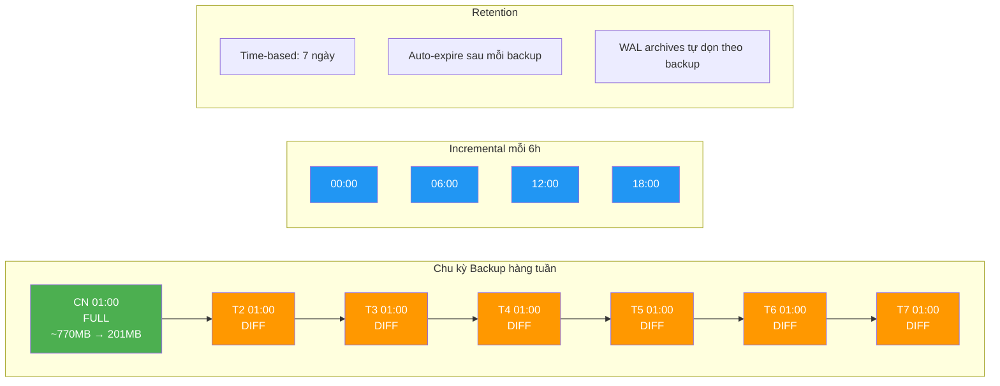
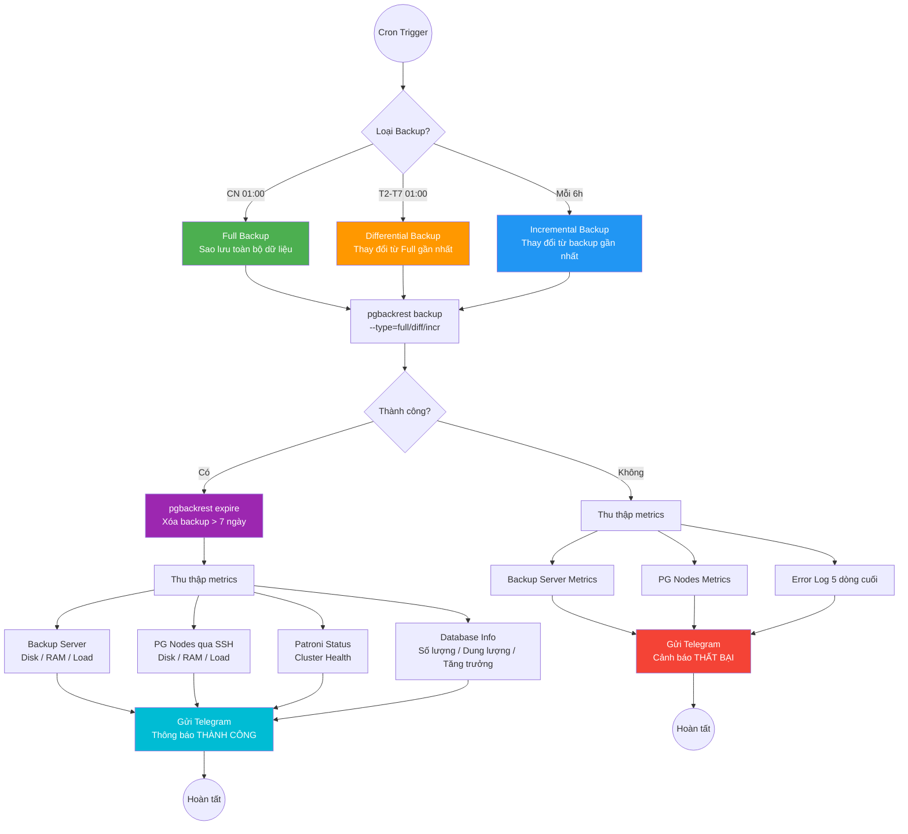
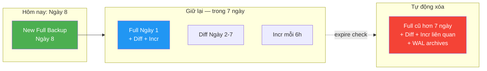
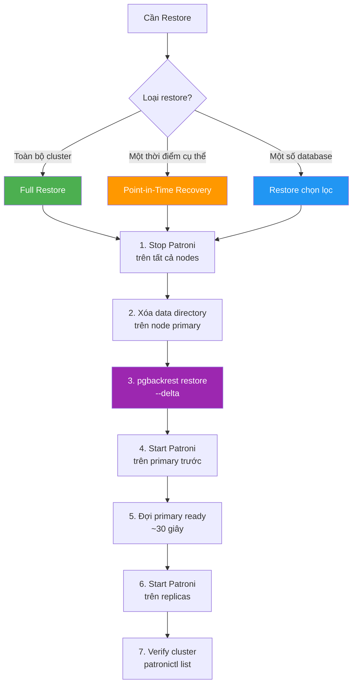

# Chiến lược Backup & Recovery — PostgreSQL HA Cluster

## Tổng quan

Hệ thống sử dụng **pgBackRest 2.58.0** để backup toàn bộ PostgreSQL 18.1 HA Cluster (3 node) sang dedicated backup server qua giao thức SSH. Hỗ trợ **Point-in-Time Recovery (PITR)**, **WAL Archiving** liên tục, và thông báo **Telegram** tự động sau mỗi lần backup.

### Thông số hiện tại (2026-03-21)

| Thông số | Giá trị |
|----------|---------|
| Database size (raw) | ~770.8 MB (11 databases) |
| Backup size (compressed) | ~201.7 MB (zstd level 3) |
| Compression ratio | ~3.8:1 |
| Retention | **7 ngày** (time-based) |
| WAL archiving | `archive_mode=on` trên cả 3 node |
| Transport | SSH (`pgbackrest` → `postgres`) |
| Backup server | pg-backup (`$BACKUP_SERVER_IP`) — 4 vCPU / 8 GB RAM |

### Danh sách Database

| Database | Size | Mô tả |
|----------|------|-------|
| btxh_beneficiary | 460 MB | Đối tượng thụ hưởng |
| btxh_report | 163 MB | Báo cáo |
| content_category | 25 MB | Danh mục nội dung |
| btxh_facility | 18 MB | Cơ sở bảo trợ |
| identity | 16 MB | Quản lý danh tính |
| openapi | 14 MB | API gateway |
| btxh_socialworker | 14 MB | Nhân viên xã hội |
| keycloak | 14 MB | Authentication |
| files | 11 MB | File storage |
| notification | 8 MB | Thông báo |
| postgres | 8 MB | System database |
| **Tổng** | **~751 MB** | **11 databases** |

---

## Kiến trúc Backup



### Luồng SSH

```
pgbackrest@pg-backup  ──SSH──►  postgres@pg-node1 (Replica)
                      ──SSH──►  postgres@pg-node2 (Leader)
                      ──SSH──►  postgres@pg-node3 (Replica)
```

- SSH key: Ed25519 (`/home/pgbackrest/.ssh/id_ed25519`)
- Backup server kết nối **với tư cách `postgres` user** trên PG nodes
- pgBackRest trên PG nodes chạy dưới `postgres` user

---

## Lịch Backup



### Cron Schedule (trên pg-backup, user: pgbackrest)

| Loại | Cron Expression | Mô tả | Tốc độ |
|------|-----------------|--------|--------|
| **Full** | `0 1 * * 0` | Chủ nhật 01:00 — Sao lưu toàn bộ | Chậm nhất (~15s) |
| **Differential** | `0 1 * * 1-6` | Thứ 2-7, 01:00 — Thay đổi kể từ Full gần nhất | Trung bình |
| **Incremental** | `0 */6 * * *` | Mỗi 6 giờ — Thay đổi kể từ backup gần nhất | Nhanh nhất |

### Ước tính dung lượng (7 ngày retention)

| Thành phần | Dung lượng ước tính |
|------------|---------------------|
| 1 Full backup (compressed) | ~202 MB |
| 6 Diff backups | ~10-50 MB mỗi cái (tùy thay đổi) |
| 28 Incr backups (4/ngày × 7 ngày) | ~1-10 MB mỗi cái |
| WAL archives (7 ngày) | ~200-500 MB |
| **Tổng ước tính repo** | **~1-2 GB** |

---

## Luồng thực thi Backup



---

## Chiến lược Retention

### Time-based Retention (7 ngày)

```ini
# /etc/pgbackrest/pgbackrest.conf
repo1-retention-full-type=time    # Dùng thời gian thay vì số lượng
repo1-retention-full=7            # Giữ backup trong 7 ngày
repo1-retention-diff=7            # Giữ diff trong 7 ngày
```

**Cách hoạt động:**

1. Sau mỗi backup thành công, `pgbackrest expire` tự động chạy
2. Xóa tất cả Full backup cũ hơn 7 ngày
3. Diff/Incr backup thuộc Full đã xóa cũng bị xóa theo
4. WAL archive files không còn cần thiết cũng bị dọn sạch

### Luồng Retention



---

## Telegram Notification

### Thông tin trong mỗi thông báo

Mỗi khi backup chạy (thành công hoặc thất bại), hệ thống tự động gửi Telegram với:

**Khi THÀNH CÔNG:**

- Loại backup (full/diff/incr), thời gian, dung lượng
- Danh sách tất cả databases + dung lượng từng DB
- Số lượng database + tổng dung lượng
- Tốc độ tăng trưởng hàng ngày (so với hôm qua)
- Thông tin backup server: disk, repo size, RAM, load
- Thông tin từng PG node: disk, RAM, load (cảnh báo nếu disk > 80%)
- Patroni cluster status (leader/replica/streaming lag)

**Khi THẤT BẠI:**

- Error code và thời gian
- Metrics tất cả servers
- 5 dòng cuối của error log

### Telegram Configuration

```bash
# Trong .env
TELEGRAM_ENABLED=true
TELEGRAM_BOT_TOKEN=<bot_token>    # Từ @BotFather
TELEGRAM_CHAT_ID=<chat_id>        # Group chat ID
```

---

## Cấu hình pgBackRest

### Backup Server (`/etc/pgbackrest/pgbackrest.conf`)

```ini
[global]
repo1-path=/var/lib/pgbackrest
repo1-retention-full-type=time
repo1-retention-full=7
repo1-retention-diff=7
compress-type=zst
compress-level=3
process-max=2
log-path=/var/log/pgbackrest
log-level-console=info
log-level-file=detail
spool-path=/var/spool/pgbackrest
start-fast=y
stop-auto=y
delta=y
archive-async=y

[main]
pg1-host=$NODE1_IP
pg1-host-user=postgres
pg1-path=/var/lib/postgresql/18/data
pg1-port=5432
pg2-host=$NODE2_IP
pg2-host-user=postgres
pg2-path=/var/lib/postgresql/18/data
pg2-port=5432
pg3-host=$NODE3_IP
pg3-host-user=postgres
pg3-path=/var/lib/postgresql/18/data
pg3-port=5432
```

### PG Node (`/etc/pgbackrest/pgbackrest.conf`)

```ini
[global]
repo1-host=$BACKUP_SERVER_IP
repo1-host-user=pgbackrest
log-path=/var/log/pgbackrest
log-level-console=info
log-level-file=detail
spool-path=/var/spool/pgbackrest
archive-async=y

[main]
pg1-path=/var/lib/postgresql/18/data
```

### Biến `.env` liên quan

```bash
PGBACKREST_ENABLED=true
PGBACKREST_STANZA=main
PGBACKREST_REPO_PATH=/var/lib/pgbackrest
PGBACKREST_RETENTION_FULL_TYPE=time
PGBACKREST_RETENTION_FULL=7
PGBACKREST_RETENTION_DIFF=7
PGBACKREST_COMPRESS_TYPE=zst
PGBACKREST_COMPRESS_LEVEL=3
PGBACKREST_PROCESS_MAX=2
PGBACKREST_FULL_SCHEDULE='0 1 * * 0'
PGBACKREST_DIFF_SCHEDULE='0 1 * * 1-6'
PGBACKREST_INCR_SCHEDULE='0 */6 * * *'
```

---

## Thao tác thủ công

### Kiểm tra trạng thái backup

```bash
# Xem thông tin backup
ssh root@$BACKUP_SERVER_IP "sudo -u pgbackrest pgbackrest --stanza=main info"

# Xem chi tiết JSON
ssh root@$BACKUP_SERVER_IP "sudo -u pgbackrest pgbackrest --stanza=main info --output=json" | python3 -m json.tool

# Kiểm tra stanza health
ssh root@$BACKUP_SERVER_IP "sudo -u pgbackrest pgbackrest --stanza=main check"
```

### Chạy backup thủ công

```bash
# Full backup
ssh root@$BACKUP_SERVER_IP "sudo -u pgbackrest pgbackrest --stanza=main --type=full backup"

# Differential backup
ssh root@$BACKUP_SERVER_IP "sudo -u pgbackrest pgbackrest --stanza=main --type=diff backup"

# Incremental backup
ssh root@$BACKUP_SERVER_IP "sudo -u pgbackrest pgbackrest --stanza=main --type=incr backup"
```

### Xóa backup cũ (expire)

```bash
ssh root@$BACKUP_SERVER_IP "sudo -u pgbackrest pgbackrest --stanza=main expire"
```

### Xem logs

```bash
# Cron job logs
ssh root@$BACKUP_SERVER_IP "tail -50 /var/log/pgbackrest/cron-full.log"
ssh root@$BACKUP_SERVER_IP "tail -50 /var/log/pgbackrest/cron-diff.log"

# pgBackRest detail logs
ssh root@$BACKUP_SERVER_IP "ls -la /var/log/pgbackrest/"
```

---

## Restore & Recovery

### Luồng Restore



### Full Cluster Restore

```bash
# 1. Stop Patroni trên tất cả nodes
ssh root@$NODE1_IP "systemctl stop patroni"
ssh root@$NODE2_IP "systemctl stop patroni"
ssh root@$NODE3_IP "systemctl stop patroni"

# 2. Xóa data cũ trên primary
ssh root@$NODE1_IP "rm -rf /var/lib/postgresql/18/data/*"

# 3. Restore từ backup mới nhất
ssh root@$NODE1_IP "sudo -u postgres pgbackrest --stanza=main --delta restore"

# 4. Start primary trước
ssh root@$NODE1_IP "systemctl start patroni"

# 5. Đợi primary sẵn sàng, start replicas
sleep 30
ssh root@$NODE2_IP "systemctl start patroni"
ssh root@$NODE3_IP "systemctl start patroni"

# 6. Kiểm tra cluster
ssh root@$NODE1_IP "patronictl -c /etc/patroni/patroni.yml list"
```

### Point-in-Time Recovery (PITR)

```bash
# Restore về thời điểm cụ thể
ssh root@$NODE1_IP "sudo -u postgres pgbackrest --stanza=main \
  --type=time \"--target=2026-03-21 14:30:00+07\" \
  --target-action=promote \
  --delta restore"
```

### Restore chọn lọc (một số database)

```bash
# Chỉ restore database identity và keycloak
ssh root@$NODE1_IP "sudo -u postgres pgbackrest --stanza=main \
  --db-include=identity --db-include=keycloak \
  --delta restore"
```

---

## Deployment

### Triển khai lần đầu

```bash
# Load environment
set -a && source .env && set +a

# Deploy toàn bộ backup infrastructure
ansible-playbook playbooks/deploy-backup.yml -i inventory/hosts.yml
```

Playbook thực hiện 4 phase:

1. **Common setup**: cài packages, hostname, firewall, chrony trên backup server
2. **pgBackRest install**: SSH keys, config, stanza creation trên backup + PG nodes
3. **Patroni reload**: bật `archive_mode=on` và `archive_command` qua DCS
4. **Initial full backup**: chạy backup đầu tiên + gửi Telegram

### Cấu trúc file

```
roles/pgbackrest/
├── defaults/main.yml                    # Default variables
├── handlers/main.yml                    # Handlers
├── tasks/main.yml                       # Install, SSH, config, stanza, cron
└── templates/
    ├── pgbackrest-repo.conf.j2          # Backup server config
    ├── pgbackrest-pg.conf.j2            # PG node config
    └── pgbackrest-backup.sh.j2          # Cron backup script + Telegram
```

---

## Troubleshooting

### Kiểm tra WAL archiving

```bash
# Archive status trên PG node
ssh root@$NODE1_IP "sudo -u postgres psql -c 'SELECT * FROM pg_stat_archiver;'"

# Kiểm tra archive_mode
ssh root@$NODE1_IP "sudo -u postgres psql -c 'SHOW archive_mode;'"
```

### Backup bị lỗi

```bash
# Xem log chi tiết
ssh root@$BACKUP_SERVER_IP "tail -100 /var/log/pgbackrest/cron-full.log"

# Kiểm tra SSH kết nối
ssh root@$BACKUP_SERVER_IP "sudo -u pgbackrest ssh postgres@$NODE1_IP hostname"

# Kiểm tra stanza
ssh root@$BACKUP_SERVER_IP "sudo -u pgbackrest pgbackrest --stanza=main check"
```

### Database tăng trưởng nhanh

```bash
# Xem lịch sử tăng trưởng
ssh root@$BACKUP_SERVER_IP "cat /var/log/pgbackrest/db_size_history.log"

# Xem dung lượng repo
ssh root@$BACKUP_SERVER_IP "du -sh /var/lib/pgbackrest/"

# Nếu repo quá lớn, chạy expire thủ công
ssh root@$BACKUP_SERVER_IP "sudo -u pgbackrest pgbackrest --stanza=main expire"
```
