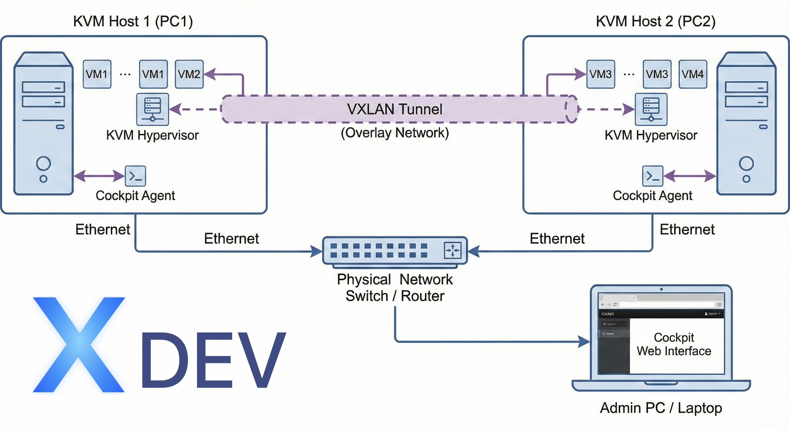

# KVM + Cockpit + VXLAN Ansible Cookbook

Ansible playbook to automatically install and configure KVM on Ubuntu with Cockpit Web UI and VXLAN overlay network for 2 KVM hosts.

## 📋 Description

This playbook automates the entire installation process from the blog: <https://xdev.asia/blog/cai-dat-kvm-tren-ubuntu-quan-ly-vm-qua-cockpit-web-ui/>

### Features

- ✅ Install KVM and required packages
- ✅ Configure network bridge (br0) for physical network
- ✅ Create NAT virtual network (vm-private) for VMs
- ✅ Configure VXLAN overlay network between 2 nodes
- ✅ Install Cockpit Web UI for VM management
- ✅ Configure storage pool for disk images
- ✅ Configure hostname and /etc/hosts
- ✅ Support nested virtualization (optional)

## 🏗️ Architecture

```
┌─────────────────────────────────────────────────────────────────┐
│                     Physical Network (192.168.1.0/24)           │
│                                                                 │
│  ┌─────────────────────┐              ┌─────────────────────┐  │
│  │   kvm-node01        │              │   kvm-node02        │  │
│  │   192.168.1.10      │◄────VXLAN────►   192.168.1.11      │  │
│  │                     │              │                     │  │
│  │  Bridge: br0        │              │  Bridge: br0        │  │
│  │  NAT: vm-private    │              │  NAT: vm-private    │  │
│  │  VXLAN: vxlan-net   │              │  VXLAN: vxlan-net   │  │
│  │  Cockpit: :9090     │              │  Cockpit: :9090     │  │
│  └─────────────────────┘              └─────────────────────┘  │
└─────────────────────────────────────────────────────────────────┘
```

## 📦 Requirements

### On control node (machine running Ansible)

- Ansible 2.9+
- Python 3.6+
- SSH access to KVM nodes

```bash
# Install Ansible on Ubuntu/Debian
sudo apt update
sudo apt install -y ansible

# Install Ansible on macOS
brew install ansible
```

### On target nodes (KVM hosts)

- Ubuntu Server 22.04 LTS or 24.04 LTS
- CPU with Hardware Virtualization support (Intel VT-x or AMD-V)
- RAM: 8GB+ (recommended 16GB+)
- Storage: 100GB+ SSD
- SSH server installed and configured
- User with sudo privileges

## 🚀 Installation

### 1. Clone repository

```bash
git clone <repository-url>
cd kvm-cockpit-vxlan-cookbook
```

### 2. Configure environment (IMPORTANT)

⚠️ **Security Note**: Never commit `.env`, `inventory.yml` or `group_vars/all.yml` files to git!

```bash
# Copy example file
cp .env.example .env

# Edit with your actual information
vim .env
# Or
nano .env
```

Configure the information in `.env`:

- IP addresses of nodes
- SSH username
- Network settings (gateway, interface, DNS)
- VXLAN, Bridge, Storage parameters...

### 3. Generate Ansible configuration

From `.env` file, automatically generate `inventory.yml` and `group_vars/all.yml`:

```bash
# Use shell script (recommended)
./scripts/generate_inventory.sh

# Or use Python script
python3 scripts/generate_inventory.py
```

### 4. [SKIP - DEPRECATED] Manual inventory configuration

~~Edit `inventory.yml` file with your information:~~

```yaml
all:
  children:
    kvm_hosts:
      hosts:
        kvm-node01:
          ansible_host: 192.168.1.10  # Replace with your IP
          host_ip: 192.168.1.10
          vxlan_remote_ip: 192.168.1.11
        
        kvm-node02:
          ansible_host: 192.168.1.11  # Replace with your IP
          host_ip: 192.168.1.11
          vxlan_remote_ip: 192.168.1.10
      
      vars:
        ansible_user: ubuntu  # Replace with your username
```

### 5. Setup SSH Keys (Recommended)

⚠️ **Important**: Use SSH keys instead of passwords for security and automation.

#### Quick method (Recommended)

```bash
# Automated SSH keys setup script
./scripts/setup-ssh-keys.sh
```

#### Manual method

```bash
# 1. Create SSH key
ssh-keygen -t ed25519 -f ~/.ssh/kvm_infrastructure_ed25519 -C "ansible@kvm"

# 2. Copy to nodes
ssh-copy-id -i ~/.ssh/kvm_infrastructure_ed25519.pub ubuntu@192.168.1.10
ssh-copy-id -i ~/.ssh/kvm_infrastructure_ed25519.pub ubuntu@192.168.1.11

# 3. Update .env
echo "SSH_KEY_PATH=~/.ssh/kvm_infrastructure_ed25519" >> .env

# 4. Re-generate inventory
./scripts/generate_inventory.sh
```

📖 **Detailed guide**: See [SSH_KEYS_GUIDE.md](SSH_KEYS_GUIDE.md)

### 6. Test connection

```bash
# Ping all hosts
ansible all -m ping

# Check sudo connection
ansible all -m shell -a "whoami" --become
```

### 7. Run playbook

#### Complete installation

```bash
# Run full playbook
ansible-playbook site.yml

# Run with verbose mode for details
ansible-playbook site.yml -v
```

#### Run by sections with tags

```bash
# Only install KVM packages
ansible-playbook site.yml --tags kvm

# Only configure network bridge
ansible-playbook site.yml --tags network

# Only configure virtual networks (NAT)
ansible-playbook site.yml --tags virtual_networks

# Only configure VXLAN
ansible-playbook site.yml --tags vxlan

# Only install Cockpit
ansible-playbook site.yml --tags cockpit

# Only configure storage pool
ansible-playbook site.yml --tags storage

# Enable nested virtualization
ansible-playbook site.yml --tags nested
```

#### Run for a specific node

```bash
# Only run for kvm-node01
ansible-playbook site.yml --limit kvm-node01

# Only run for kvm-node02
ansible-playbook site.yml --limit kvm-node02
```

## 📁 Directory structure

```
kvm-cockpit-vxlan-cookbook/
├── ansible.cfg                 # Ansible configuration
├── inventory.yml              # Inventory with 2 nodes information
├── site.yml                   # Main playbook
├── group_vars/
│   └── all.yml               # Global variables
├── host_vars/                # Host-specific variables (optional)
└── roles/
    ├── common/               # Configure hostname and /etc/hosts
    │   └── tasks/main.yml
    ├── kvm_install/          # Install KVM and packages
    │   └── tasks/main.yml
    ├── network_bridge/       # Configure bridge network
    │   ├── tasks/main.yml
    │   ├── templates/01-bridge-config.yaml.j2
    │   └── handlers/main.yml
    ├── virtual_networks/     # Configure NAT virtual network
    │   ├── tasks/main.yml
    │   └── templates/vm-private-network.xml.j2
    ├── vxlan_overlay/        # Configure VXLAN overlay
    │   ├── tasks/main.yml
    │   ├── templates/02-vxlan.yaml.j2
    │   ├── templates/vxlan-network.xml.j2
    │   └── handlers/main.yml
    ├── cockpit/              # Install Cockpit Web UI
    │   └── tasks/main.yml
    ├── storage_pool/         # Configure storage pool
    │   └── tasks/main.yml
    └── nested_virtualization/ # Nested virtualization (optional)
        └── tasks/main.yml
```

## 🔧 Detailed Variables

### Network Configuration

| Variable | Description | Default |
|----------|-------------|---------|
| `gateway` | Physical network gateway | `192.168.1.1` |
| `network_cidr` | Physical network CIDR | `24` |
| `primary_interface` | Primary network interface | `enp0s3` |
| `dns_servers` | DNS servers list | `[8.8.8.8, 8.8.4.4]` |

### Bridge Configuration

| Variable | Description | Default |
|----------|-------------|---------|
| `bridge_name` | Bridge interface name | `br0` |
| `bridge_mtu` | Bridge MTU | `1500` |
| `bridge_stp` | Enable Spanning Tree Protocol | `true` |
| `bridge_forward_delay` | Forward delay | `4` |

### Virtual Network (NAT)

| Variable | Description | Default |
|----------|-------------|---------|
| `vm_private_network_name` | Virtual network name | `vm-private` |
| `vm_private_subnet` | Virtual network subnet | `10.10.10.0/24` |
| `vm_private_gateway` | Virtual network gateway | `10.10.10.1` |
| `vm_private_bridge` | Virtual network bridge | `virbr1` |

### VXLAN Configuration

| Variable | Description | Default |
|----------|-------------|---------|
| `vxlan_interface` | VXLAN interface name | `vxlan100` |
| `vxlan_vni` | VXLAN Network Identifier | `100` |
| `vxlan_port` | VXLAN destination port | `4789` |
| `vxlan_bridge` | VXLAN bridge name | `vxlan-br0` |
| `vxlan_mtu` | VXLAN MTU | `1450` |

### Storage Configuration

| Variable | Description | Default |
|----------|-------------|---------|
| `storage_pool_name` | Storage pool name | `default` |
| `storage_pool_path` | Storage pool path | `/var/lib/libvirt/images` |

### Cockpit Configuration

| Variable | Description | Default |
|----------|-------------|---------|
| `cockpit_port` | Cockpit Web UI port | `9090` |
| `enable_firewall` | Enable firewall rules | `false` |

## 🌐 Access Cockpit Web UI

After the playbook completes, you can access Cockpit Web UI:

- **kvm-node01**: <https://192.168.1.10:9090>
- **kvm-node02**: <https://192.168.1.11:9090>

Login with your Linux user (user must be in `libvirt` and `kvm` groups).

## 📡 Verify Configuration

### Check KVM

```bash
# Check KVM modules
ssh kvm-node01 'lsmod | grep kvm'

# Check libvirtd service
ssh kvm-node01 'systemctl status libvirtd'

# List VMs
ssh kvm-node01 'virsh list --all'
```

### Check Network

```bash
# Check bridge
ssh kvm-node01 'brctl show'
ssh kvm-node01 'ip addr show br0'

# Check VXLAN
ssh kvm-node01 'ip -d link show vxlan100'
ssh kvm-node01 'bridge link show'

# Check virtual networks
ssh kvm-node01 'virsh net-list --all'
ssh kvm-node01 'virsh net-info vm-private'
ssh kvm-node01 'virsh net-info vxlan-net'
```

### Check Storage

```bash
# Check storage pool
ssh kvm-node01 'virsh pool-list --all'
ssh kvm-node01 'virsh pool-info default'
```

## 🖥️ Create Your First VM

### Using Cloud Image (Recommended)

```bash
# SSH to node
ssh kvm-node01

# Download Ubuntu Cloud Image
cd /var/lib/libvirt/images
sudo wget https://cloud-images.ubuntu.com/jammy/current/jammy-server-cloudimg-amd64.img

# Create disk image for VM
sudo qemu-img create -f qcow2 \
    -F qcow2 \
    -b jammy-server-cloudimg-amd64.img \
    vm-test-01.qcow2 20G

# Create cloud-init config
sudo mkdir -p /var/lib/libvirt/cloud-init

# Meta-data
sudo tee /var/lib/libvirt/cloud-init/meta-data << EOF
instance-id: vm-test-01
local-hostname: vm-test-01
EOF

# User-data
sudo tee /var/lib/libvirt/cloud-init/user-data << EOF
#cloud-config
hostname: vm-test-01
users:
  - name: ubuntu
    sudo: ALL=(ALL) NOPASSWD:ALL
    groups: users, admin
    home: /home/ubuntu
    shell: /bin/bash
    lock_passwd: false
    plain_text_passwd: 'ubuntu123'

package_update: true
packages:
  - qemu-guest-agent
EOF

# Create cloud-init ISO
sudo cloud-localds /var/lib/libvirt/images/vm-test-01-cidata.iso \
    /var/lib/libvirt/cloud-init/user-data \
    /var/lib/libvirt/cloud-init/meta-data

# Create VM with vm-private network (NAT)
sudo virt-install \
    --name vm-test-01 \
    --memory 2048 \
    --vcpus 2 \
    --disk path=/var/lib/libvirt/images/vm-test-01.qcow2,format=qcow2 \
    --disk path=/var/lib/libvirt/images/vm-test-01-cidata.iso,device=cdrom \
    --os-variant ubuntu22.04 \
    --network network=vm-private \
    --graphics none \
    --import \
    --noautoconsole

# View VM IP
virsh domifaddr vm-test-01
# Or
virsh net-dhcp-leases vm-private
```

### Create VM with VXLAN network

```bash
# Create VM connected to VXLAN overlay network
sudo virt-install \
    --name vm-vxlan-01 \
    --memory 2048 \
    --vcpus 2 \
    --disk path=/var/lib/libvirt/images/vm-vxlan-01.qcow2,size=20 \
    --os-variant ubuntu22.04 \
    --network network=vxlan-net \
    --graphics vnc \
    --cdrom /var/lib/libvirt/images/ubuntu-22.04.3-live-server-amd64.iso \
    --noautoconsole
```

## 🎯 Use Cases

### 1. Development/Testing with NAT Network

Use `vm-private` network for VMs that need internet but don't need external exposure:

```bash
--network network=vm-private
```

### 2. Production with Bridge Network

Use bridge `br0` for VMs that need IP in physical network:

```bash
--network bridge=br0
```

### 3. Multi-Node Cluster with VXLAN

Use `vxlan-net` for VMs on 2 nodes that need direct communication:

```bash
# On kvm-node01
--network network=vxlan-net

# On kvm-node02
--network network=vxlan-net

# VMs can ping each other directly via Layer 2
```

### 4. Dual NIC VM

VM with 2 NICs (internal + external):

```bash
--network network=vm-private \
--network bridge=br0
```

## 🔍 Troubleshooting

### Network bridge not working

```bash
# Check netplan config
sudo netplan --debug generate
sudo netplan --debug apply

# View logs
sudo journalctl -u systemd-networkd -f

# Rollback if issues occur
sudo cp /etc/netplan/backup/*.yaml /etc/netplan/
sudo netplan apply
```

### VXLAN not connecting between 2 nodes

```bash
# Check VXLAN interface
ip -d link show vxlan100

# Test connectivity between 2 nodes
ping 192.168.1.11  # From node01 to node02

# Check firewall
sudo ufw status
# If enabled, need to allow port 4789
sudo ufw allow 4789/udp
```

### VM has no IP

```bash
# Restart VM
virsh destroy vm-test-01
virsh start vm-test-01

# Inside VM, request DHCP
sudo dhclient -v

# Check DHCP leases
virsh net-dhcp-leases vm-private
```

### Permission denied with virsh

```bash
# Check groups
groups

# Add user to groups (if not already)
sudo usermod -aG libvirt,kvm $USER

# Logout and login again
# Or run
newgrp libvirt
```

## 📚 References

- Original blog: <https://xdev.asia/blog/cai-dat-kvm-tren-ubuntu-quan-ly-vm-qua-cockpit-web-ui/>
- [KVM Documentation](https://www.linux-kvm.org/)
- [Libvirt Documentation](https://libvirt.org/docs.html)
- [Cockpit Project](https://cockpit-project.org/)
- [VXLAN - Linux Kernel](https://www.kernel.org/doc/Documentation/networking/vxlan.txt)
- [Netplan Documentation](https://netplan.io/)

## 🤝 Contributing

Contributions are welcome! Please feel free to submit a Pull Request.

## 📝 License

MIT License

## 👤 Author

[XDEV ASIA](https://xdev.asia/)

## 📧 Support

If you encounter issues, please:

1. Check the Troubleshooting section
2. View logs: `ansible-playbook site.yml -vvv`
3. Create an issue on GitHub
4. Contact via blog: <https://xdev.asia/>
